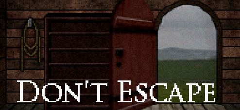

# Grupo 4 - Don't Escape



## Alunos

| Matrícula  | Aluno                        |
| ---------- | ---------------------------- |
| 19/0024950 | Arthur de Melo Garcia        |
| 19/0025379 | Brenno Oliveira Silva        |
| 19/0027088 | Elias Yousef Santana Ali     |
| 19/0027355 | Erick Melo Vidal de Oliveira |
| 19/0047968 | Paulo Vitor Silva Abi Acl    |

## Sobre

Repositório para desenvolvimento do projeto Dont Escape da disciplina SBD1.

## Como rodar o projeto

**Pré-requisitos**: NodeJs > 17 e Postgresql

1. Após clonar o repositório, abra a pasta ./scripts

2. Rode os arquivos DDL.sql, Triggers.sql e DML.sql

3. Acesse a pasta ./codigo

4. Crie um arquivo .env com as seguintes informações:
```
USER = "postgres"       -- Seu usuario do postgres
HOST = "localhost"      -- Host configurado no postgres
DATABASE = "dontEscape" -- Nome do banco do jogo
PASSWORD = "1423asd"    -- Senha do banco
PORT = "5432"           -- Porta utilizada pelo postgresql
```

5. Rode o seguinte comando para instalar os pacotes do node:
```
npm i
```

6. Para iniciar o jogo, execute o comando:
```
npm run server
```

*Recomenda-se que o terminal do jogo tenha 140 colunas e 48 linhas

<hr>

## Módulo 1

[Video da Apresentação](https://github.com/SBD1/Grupo4-DontEscape/blob/main/apresentacoes/modulo1.mp4)

<hr>

## Módulo 2

[Video da Apresentação](https://github.com/SBD1/Grupo4-DontEscape/blob/main/apresentacoes/modulo2.mp4)

<hr>

## Módulo 3

[Video da Apresentação](https://github.com/SBD1/Grupo4-DontEscape/blob/main/apresentacoes/modulo3.mp4)

<hr>

## Entrega Final

[Video da Apresentação](https://github.com/SBD1/Grupo4-DontEscape/blob/main/apresentacoes/entregaFinal.mp4)

<hr>
